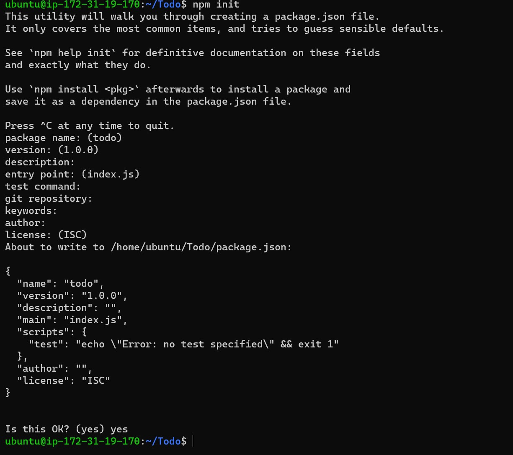

## MERN PROJECT-3

`sudo apt update`

`sudo apt upgrade`

`curl -sL https://deb.nodesource.com/setup_12.x | sudo -E bash -`

`sudo apt-get install -y nodejs`

`node -v `

`npm -v `

`mkdir Todo`

`cd Todo`

`npm init`

`code`

`code`

`code`

`code`

`code`